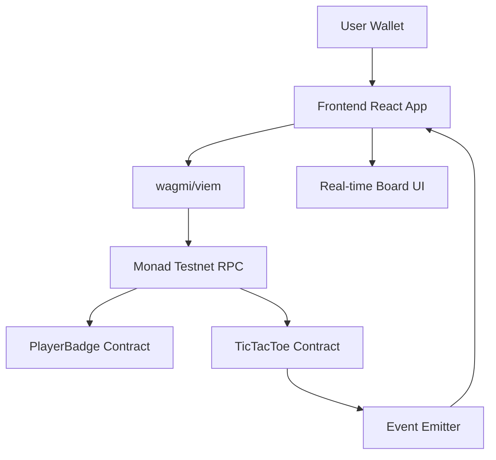
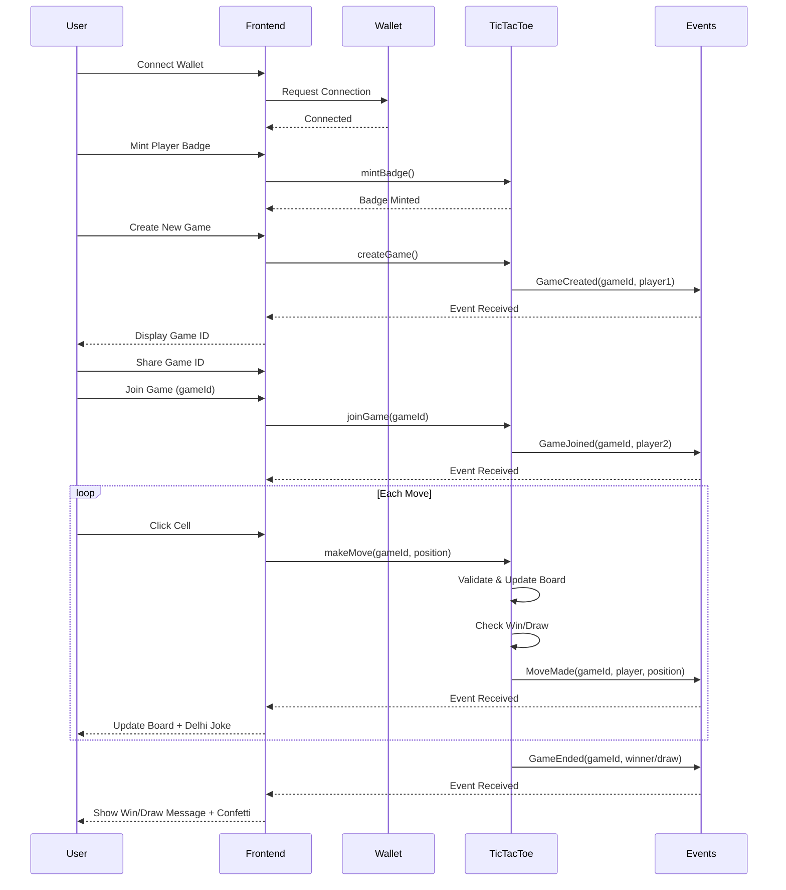

# Design Document: Delhi Ka Khel – On-Chain Tic Tac Toe

## Overview

Delhi Ka Khel is a fully on-chain Tic Tac Toe game built for Monad Testnet, themed around Delhi's chaotic traffic culture. Every move is a real blockchain transaction, showcasing Monad's speed with high testnet activity. Players mint a fun "Delhi Player Badge" NFT once, then create or join games using unique game IDs. The UI features playful Delhi traffic humor (🚦 vs 🛑), real-time board updates via contract events, and instant win/draw detection. Built with Solidity 0.8.28, Hardhat, Vite, React, TypeScript, Tailwind, and wagmi/viem for a clean, reliable, demo-ready experience.

## Architecture



## Main Algorithm/Workflow



## Core Interfaces/Types

### Smart Contract Interfaces

```solidity
// PlayerBadge.sol - ERC-721 NFT
interface IPlayerBadge {
    function mintBadge(string memory playerName) external returns (uint256);
    function hasBadge(address player) external view returns (bool);
    function getPlayerName(address player) external view returns (string memory);
}

// TicTacToe.sol - Game Logic
interface ITicTacToe {
    enum GameStatus { Waiting, Active, Finished }
    enum CellState { Empty, X, O }
    
    struct Game {
        address player1;
        address player2;
        address currentTurn;
        CellState[9] board;
        GameStatus status;
        address winner;
        bool isDraw;
    }
    
    function createGame() external returns (uint256 gameId);
    function joinGame(uint256 gameId) external;
    function makeMove(uint256 gameId, uint8 position) external;
    function getGame(uint256 gameId) external view returns (Game memory);
    function getBoard(uint256 gameId) external view returns (CellState[9] memory);
}
```

### Frontend TypeScript Types

```typescript
// types.ts
export enum CellState {
    Empty = 0,
    X = 1,
    O = 2
}

export enum GameStatus {
    Waiting = 0,
    Active = 1,
    Finished = 2
}

export interface Game {
    player1: `0x${string}`;
    player2: `0x${string}`;
    currentTurn: `0x${string}`;
    board: CellState[];
    status: GameStatus;
    winner: `0x${string}`;
    isDraw: boolean;
}

export interface PlayerBadge {
    tokenId: bigint;
    playerName: string;
}
```

## Key Functions with Formal Specifications

### Function 1: createGame()

```solidity
function createGame() external returns (uint256 gameId)
```

**Preconditions:**
- Caller must have minted a PlayerBadge NFT
- Caller's wallet must be connected

**Postconditions:**
- New game created with unique gameId
- Game status is `Waiting`
- player1 is set to msg.sender
- Board is initialized with all Empty cells
- GameCreated event is emitted

**Loop Invariants:** N/A

### Function 2: joinGame()

```solidity
function joinGame(uint256 gameId) external
```

**Preconditions:**
- Game with gameId must exist
- Game status must be `Waiting`
- Caller must have minted a PlayerBadge NFT
- Caller must not be player1
- player2 must be address(0)

**Postconditions:**
- player2 is set to msg.sender
- Game status changes to `Active`
- currentTurn is set to player1
- GameJoined event is emitted

**Loop Invariants:** N/A

### Function 3: makeMove()

```solidity
function makeMove(uint256 gameId, uint8 position) external
```

**Preconditions:**
- Game with gameId must exist
- Game status must be `Active`
- position must be between 0 and 8
- board[position] must be Empty
- msg.sender must be currentTurn
- Game must not be finished

**Postconditions:**
- board[position] is set to X or O based on player
- currentTurn switches to other player
- If win condition met: status = Finished, winner = msg.sender
- If draw condition met: status = Finished, isDraw = true
- MoveMade event is emitted
- If game ended: GameEnded event is emitted

**Loop Invariants:**
- Win check loops maintain: All previously checked patterns remain valid
- Board state remains consistent throughout validation

### Function 4: checkWinner()

```solidity
function checkWinner(uint256 gameId) internal view returns (bool)
```

**Preconditions:**
- Game with gameId must exist
- At least 5 moves have been made (minimum for a win)

**Postconditions:**
- Returns true if any winning pattern (3 in a row) is found
- Returns false otherwise
- No state mutations

**Loop Invariants:**
- All winning patterns checked: rows, columns, diagonals
- Pattern validation remains consistent throughout iteration

## Algorithmic Pseudocode

### Main Game Flow Algorithm

```typescript
ALGORITHM playGameFlow(userAddress)
INPUT: userAddress of type Address
OUTPUT: gameResult of type GameResult

BEGIN
  ASSERT userAddress is connected to Monad Testnet
  
  // Step 1: Ensure player has badge
  IF NOT hasBadge(userAddress) THEN
    badgeName ← getUserInput("Enter your Delhi player name")
    ASSERT badgeName is non-empty string
    
    txHash ← mintBadge(badgeName)
    AWAIT transactionConfirmation(txHash)
  END IF
  
  // Step 2: Create or join game
  gameChoice ← getUserChoice("Create New Game" OR "Join Existing Game")
  
  IF gameChoice = "Create New Game" THEN
    gameId ← createGame()
    AWAIT transactionConfirmation()
    
    DISPLAY "Game ID: " + gameId + " - Share with friend!"
    AWAIT player2JoinsGame(gameId)
  ELSE
    gameId ← getUserInput("Enter Game ID")
    ASSERT gameId exists AND game.status = Waiting
    
    joinGame(gameId)
    AWAIT transactionConfirmation()
  END IF
  
  // Step 3: Play game loop
  WHILE game.status = Active DO
    ASSERT gameStateIsValid(gameId)
    
    IF game.currentTurn = userAddress THEN
      DISPLAY "Tera Turn Hai! 🚦"
      position ← getUserCellClick(0 to 8)
      
      ASSERT board[position] = Empty
      
      makeMove(gameId, position)
      AWAIT transactionConfirmation()
      
      DISPLAY randomDelhiJoke()
    ELSE
      DISPLAY "Waiting for Dost... 🛑"
      AWAIT opponentMove(gameId)
    END IF
    
    // Real-time board update via events
    listenForMoveMadeEvent(gameId)
  END WHILE
  
  // Step 4: Display result
  IF game.winner = userAddress THEN
    DISPLAY "Haan Bhai! Traffic Clear Ho Gaya! 🏆"
    triggerConfetti()
  ELSE IF game.isDraw THEN
    DISPLAY "Arre Yaar, Traffic Jam! Next Round? 🚧"
  ELSE
    DISPLAY "Better luck next time! Metro le le bhai! 🚇"
  END IF
  
  RETURN gameResult
END
```

**Preconditions:**
- User has Monad Testnet configured in wallet
- User has MON tokens for gas
- Smart contracts are deployed and accessible

**Postconditions:**
- Game is completed (win or draw)
- All moves are recorded on-chain
- Final game state is consistent
- UI displays appropriate result message

**Loop Invariants:**
- Game state remains valid throughout play loop
- Current turn alternates between players
- Board state matches on-chain state
- No invalid moves are accepted

### Win Detection Algorithm

```typescript
ALGORITHM checkWinCondition(board, lastPlayer)
INPUT: board of type CellState[9], lastPlayer of type CellState
OUTPUT: hasWon of type boolean

BEGIN
  // Define winning patterns (indices)
  winPatterns ← [
    [0, 1, 2], [3, 4, 5], [6, 7, 8],  // Rows
    [0, 3, 6], [1, 4, 7], [2, 5, 8],  // Columns
    [0, 4, 8], [2, 4, 6]              // Diagonals
  ]
  
  // Check each pattern
  FOR each pattern IN winPatterns DO
    ASSERT pattern has exactly 3 indices
    
    [a, b, c] ← pattern
    
    IF board[a] = lastPlayer AND 
       board[b] = lastPlayer AND 
       board[c] = lastPlayer THEN
      RETURN true
    END IF
  END FOR
  
  // No winning pattern found
  RETURN false
END
```

**Preconditions:**
- board is valid array of 9 CellState values
- lastPlayer is either X or O (not Empty)
- At least 5 moves have been made

**Postconditions:**
- Returns true if and only if lastPlayer has 3 in a row
- Returns false otherwise
- No mutations to board state

**Loop Invariants:**
- All patterns are checked exactly once
- Pattern indices remain valid (0-8)
- Board state remains unchanged throughout iteration

### Draw Detection Algorithm

```typescript
ALGORITHM checkDrawCondition(board)
INPUT: board of type CellState[9]
OUTPUT: isDraw of type boolean

BEGIN
  // Check if board is full
  FOR i FROM 0 TO 8 DO
    IF board[i] = Empty THEN
      RETURN false  // Still have empty cells
    END IF
  END FOR
  
  // Board is full and no winner (checked before this)
  RETURN true
END
```

**Preconditions:**
- board is valid array of 9 CellState values
- checkWinCondition has already returned false

**Postconditions:**
- Returns true if all cells are filled
- Returns false if any cell is Empty
- No mutations to board state

**Loop Invariants:**
- All cells checked sequentially
- Empty cell detection is accurate
- Board state remains unchanged

## Example Usage

### Smart Contract Usage

```solidity
// Deploy contracts
PlayerBadge badge = new PlayerBadge();
TicTacToe game = new TicTacToe(address(badge));

// Player 1: Mint badge and create game
badge.mintBadge("Delhi Speedster");
uint256 gameId = game.createGame();
// gameId = 1

// Player 2: Mint badge and join game
badge.mintBadge("Traffic Warrior");
game.joinGame(1);

// Player 1 makes first move (center)
game.makeMove(1, 4);

// Player 2 makes move (top-left)
game.makeMove(1, 0);

// Continue until win or draw...
```

### Frontend Usage

```typescript
// Connect wallet
import { useAccount, useConnect } from 'wagmi';

function App() {
  const { address, isConnected } = useAccount();
  const { connect, connectors } = useConnect();
  
  // Mint badge
  const { write: mintBadge } = useContractWrite({
    address: PLAYER_BADGE_ADDRESS,
    abi: PlayerBadgeABI,
    functionName: 'mintBadge',
    args: ['Delhi Speedster'],
  });
  
  // Create game
  const { write: createGame } = useContractWrite({
    address: TICTACTOE_ADDRESS,
    abi: TicTacToeABI,
    functionName: 'createGame',
  });
  
  // Make move
  const { write: makeMove } = useContractWrite({
    address: TICTACTOE_ADDRESS,
    abi: TicTacToeABI,
    functionName: 'makeMove',
    args: [gameId, position],
  });
  
  // Listen for events
  useContractEvent({
    address: TICTACTOE_ADDRESS,
    abi: TicTacToeABI,
    eventName: 'MoveMade',
    listener: (logs) => {
      const { gameId, player, position } = logs[0].args;
      updateBoard(gameId, position);
      showDelhiJoke();
    },
  });
  
  return (
    <div className="min-h-screen bg-purple-900">
      {!isConnected ? (
        <button onClick={() => connect({ connector: connectors[0] })}>
          Connect Wallet
        </button>
      ) : (
        <GameBoard gameId={currentGameId} />
      )}
    </div>
  );
}
```

## Correctness Properties

*A property is a characteristic or behavior that should hold true across all valid executions of a system—essentially, a formal statement about what the system should do. Properties serve as the bridge between human-readable specifications and machine-verifiable correctness guarantees.*

### Property 1: Badge Minting Round Trip

For any valid player name, minting a badge then querying the badge holder's name should return the same name.

**Validates: Requirements 1.1, 1.3, 1.4**

### Property 2: Badge Uniqueness

For any address, minting a badge once should succeed, but attempting to mint a second badge should fail.

**Validates: Requirement 1.2**

### Property 3: Empty Name Rejection

For any string composed entirely of whitespace or empty string, attempting to mint a badge should be rejected.

**Validates: Requirements 1.5, 14.3**

### Property 4: Game ID Uniqueness

For any sequence of game creations, all generated Game_IDs should be unique.

**Validates: Requirement 2.1**

### Property 5: New Game Initialization

For any newly created game, the Board should have all nine cells set to Empty, Game_Status should be Waiting, and player1 should equal the creator's address.

**Validates: Requirements 2.2, 2.3, 2.4**

### Property 6: Badge Holder Access Control

For any address without a badge, attempts to create a game, join a game, or make a move should be rejected.

**Validates: Requirements 2.6, 3.5, 19.4**

### Property 7: Game Join State Transition

For any game in Waiting status, when a badge holder joins, the Game_Status should transition to Active, player2 should be set to the joiner's address, and Current_Turn should be set to player1.

**Validates: Requirements 3.1, 3.2, 3.3**

### Property 8: Invalid Join Rejection

For any game, attempts to join should be rejected if: the game does not exist, the game is not in Waiting status, or the joiner is player1.

**Validates: Requirements 3.6, 3.7, 3.8**

### Property 9: Move Validity

For any game and position, makeMove succeeds if and only if: the game status is Active, the position is between 0-8, the cell at that position is Empty, and the caller is the Current_Turn player.

**Validates: Requirements 4.1, 4.4, 4.5, 4.7**

### Property 10: Turn Alternation

For any valid move in an active game, the Current_Turn after the move should be different from the Current_Turn before the move.

**Validates: Requirement 4.2**

### Property 11: Win Detection Completeness

For any board state, if any of the eight Win_Patterns (three rows, three columns, two diagonals) contains three identical non-Empty symbols, the game should be marked as Finished with the appropriate winner.

**Validates: Requirements 5.1, 5.2, 5.4, 5.5**

### Property 12: Draw Detection

For any game where all nine cells are filled and no Win_Pattern exists, the game should be marked as Finished with isDraw set to true and winner remaining address(0).

**Validates: Requirements 6.1, 6.2, 6.4**

### Property 13: Game Finality

For any game, if Game_Status is Finished, then exactly one of the following is true: winner is not address(0), or isDraw is true.

**Validates: Requirement 6.1**

### Property 14: Board Immutability After Completion

For any game with Game_Status set to Finished, all attempts to call makeMove should be rejected and the Board state should remain unchanged.

**Validates: Requirements 7.1, 7.2, 19.6**

### Property 15: State Query Consistency

For any valid Game_ID, querying the game state should return complete and accurate data including all nine Cell_State values, player addresses, Current_Turn, and Game_Status.

**Validates: Requirements 7.3, 13.1, 13.2**

### Property 16: Frontend State Synchronization

For any game being monitored, the Frontend state should match the on-chain game state after processing all emitted events.

**Validates: Requirement 8.5**

### Property 17: Network Validation

For any transaction attempt, the Frontend should verify the Wallet is connected to Monad_Testnet before allowing submission.

**Validates: Requirement 9.6**

### Property 18: Transaction Feedback

For any transaction initiated by a user, the Frontend should display: a pending indicator during processing, a success notification on confirmation, or an error message with failure reason on rejection.

**Validates: Requirements 11.1, 11.2, 11.3**

### Property 19: Transaction Explorer Links

For any completed transaction, the Frontend should provide a link to view the transaction on Monad Testnet Explorer.

**Validates: Requirement 11.5**

### Property 20: Balance Validation

For any transaction attempt, if the user's MON balance is insufficient, the Frontend should detect this before submission and display a message with a faucet link.

**Validates: Requirement 12.1**

### Property 21: Game Existence Validation

For any operation requiring a Game_ID, the contract should verify the game exists before processing.

**Validates: Requirement 14.2**

### Property 22: Validation Error Messages

For any validation failure in the system, a clear error message should be provided indicating the specific validation failure reason.

**Validates: Requirement 14.5**

### Property 23: Event Emission Guarantee

For any state-changing function that completes successfully, the corresponding event should be emitted: GameCreated for createGame, GameJoined for joinGame, MoveMade for makeMove, and GameEnded when a game finishes.

**Validates: Requirements 2.5, 3.4, 4.3, 5.3, 6.3, 15.1, 15.2, 15.3, 15.4**

### Property 24: Multi-Game Independence

For any address participating in multiple games, each game should maintain independent state without interference, and switching between games should load the correct Board state for the selected Game_ID.

**Validates: Requirements 18.1, 18.3, 18.4**

## Error Handling

### Error Scenario 1: Invalid Move Position

**Condition**: User attempts to place move in occupied cell or out-of-bounds position
**Response**: Transaction reverts with error "Invalid move: cell already occupied" or "Invalid position"
**Recovery**: Frontend prevents invalid clicks, shows error toast with Delhi-style message: "Arre bhai, wahan already gaadi khadi hai! 🚗"

### Error Scenario 2: Wrong Turn

**Condition**: Player attempts to make move when it's not their turn
**Response**: Transaction reverts with error "Not your turn"
**Recovery**: Frontend disables board interaction when not player's turn, shows "Waiting for Dost... 🛑"

### Error Scenario 3: Game Not Found

**Condition**: User tries to join non-existent game ID
**Response**: Transaction reverts with error "Game does not exist"
**Recovery**: Frontend validates game ID before join attempt, shows error: "Game ID nahi mila! Check kar le bhai 🔍"

### Error Scenario 4: No Player Badge

**Condition**: User attempts game action without minting badge first
**Response**: Transaction reverts with error "Must have player badge"
**Recovery**: Frontend checks badge status, prompts mint flow with message: "Pehle badge le le, phir khel! 🎫"

### Error Scenario 5: Network/RPC Failure

**Condition**: Monad Testnet RPC is unreachable or slow
**Response**: Transaction timeout or connection error
**Recovery**: Frontend shows retry button, implements exponential backoff, displays: "Network slow hai, retry kar! 📡"

### Error Scenario 6: Insufficient Gas

**Condition**: User wallet has insufficient MON for transaction
**Response**: Transaction fails with "insufficient funds" error
**Recovery**: Frontend checks balance before transaction, shows faucet link: "MON tokens khatam! Faucet se le le: https://faucet.monad.xyz 💰"

## Testing Strategy

### Unit Testing Approach

**Smart Contracts (Hardhat + Chai)**:
- Test each function in isolation with valid and invalid inputs
- Verify all require statements trigger correctly
- Check event emissions for all state changes
- Test edge cases: first move, last move, all win patterns, draw scenarios
- Gas optimization tests for makeMove function
- Coverage goal: 100% for critical game logic

**Key Test Cases**:
1. PlayerBadge: Mint once per address, prevent duplicate mints, retrieve player names
2. TicTacToe: Create game, join game, make valid moves, reject invalid moves
3. Win detection: Test all 8 winning patterns (3 rows, 3 columns, 2 diagonals)
4. Draw detection: Fill board without winner
5. Access control: Only badge holders can play, only current turn can move

**Frontend (Vitest + React Testing Library)**:
- Component rendering tests
- User interaction flows (click cells, connect wallet)
- State management tests
- Event listener tests
- Mock contract interactions

### Property-Based Testing Approach

**Property Test Library**: fast-check (for TypeScript/JavaScript)

**Properties to Test**:

1. **Move Sequence Validity**: Any sequence of valid moves maintains game state consistency
2. **Win Detection Determinism**: Same board state always produces same win result
3. **Turn Alternation**: Regardless of move sequence, turns always alternate
4. **Board Bounds**: No move can modify cells outside 0-8 range
5. **Game Finality**: Once game ends, no further moves are possible

**Example Property Test**:
```typescript
import fc from 'fast-check';

test('any valid move sequence maintains turn alternation', () => {
  fc.assert(
    fc.property(
      fc.array(fc.integer({ min: 0, max: 8 }), { minLength: 1, maxLength: 9 }),
      (moveSequence) => {
        const game = createTestGame();
        let currentPlayer = game.player1;
        
        for (const position of moveSequence) {
          if (game.board[position] === CellState.Empty && game.status === GameStatus.Active) {
            makeMove(game, position);
            // Property: turn must alternate
            expect(game.currentTurn).not.toBe(currentPlayer);
            currentPlayer = game.currentTurn;
          }
        }
      }
    )
  );
});
```

### Integration Testing Approach

**End-to-End Flow Tests**:
1. Deploy contracts to local Hardhat network
2. Simulate full game flow: connect wallet → mint badge → create game → join game → play to completion
3. Test multiple simultaneous games
4. Verify event-driven UI updates
5. Test network failure recovery

**Demo Rehearsal Tests**:
- Run complete demo flow on Monad Testnet
- Verify transaction speed and confirmation times
- Test with multiple wallets/browsers simultaneously
- Ensure UI remains responsive during high activity

## Performance Considerations

**Smart Contract Optimization**:
- Use uint8 for positions (0-8) to minimize gas
- Pack struct fields efficiently (address + enums)
- Minimize storage writes in makeMove function
- Use memory arrays for board reads
- Inline win check logic to avoid extra function calls

**Frontend Optimization**:
- Implement optimistic UI updates (show move immediately, confirm on-chain)
- Use React.memo for board cells to prevent unnecessary re-renders
- Debounce event listeners to prevent UI thrashing
- Cache game state locally, sync with events
- Lazy load confetti animation library

**Network Optimization**:
- Use Monad's fast block times (~1 second) for quick confirmations
- Implement short polling (2-3 seconds) as backup to events
- Batch multiple game state reads into single RPC call
- Use multicall pattern for reading multiple games

**Target Metrics**:
- Move confirmation: < 2 seconds on Monad Testnet
- UI update latency: < 500ms after transaction confirmation
- Page load time: < 2 seconds
- Support 10+ simultaneous games without performance degradation

## Security Considerations

**Smart Contract Security**:
- Use OpenZeppelin's audited ERC-721 implementation
- Implement reentrancy guards on state-changing functions (though not strictly needed for this use case)
- Validate all inputs with require statements
- Use SafeMath operations (built-in Solidity 0.8.28)
- Prevent integer overflow/underflow
- Access control: Only badge holders can play
- Game state immutability after completion

**Frontend Security**:
- Validate all user inputs before sending transactions
- Sanitize game IDs and player names
- Use viem's type-safe contract interactions
- Never expose private keys or sensitive data
- Implement proper error handling for failed transactions
- Display clear transaction confirmations before signing

**Threat Mitigation**:
1. **Griefing**: Player creates game but never plays → Time-based game expiration (optional future feature)
2. **Front-running**: Not applicable (no financial incentive)
3. **Replay attacks**: Nonce-based transaction ordering prevents this
4. **Sybil attacks**: Badge requirement provides minimal barrier
5. **DoS**: Rate limiting on frontend, gas costs provide natural DoS protection

**Audit Recommendations**:
- Manual code review before mainnet deployment
- Automated security scanning with Slither or Mythril
- Test on testnet extensively before any mainnet consideration

## Dependencies

**Smart Contract Dependencies**:
- Solidity: ^0.8.28
- OpenZeppelin Contracts: ^5.0.0 (for ERC-721)
- Hardhat: ^2.19.0
- Hardhat Ethers: ^3.0.0
- @nomicfoundation/hardhat-toolbox: ^4.0.0

**Frontend Dependencies**:
- React: ^18.2.0
- TypeScript: ^5.3.0
- Vite: ^5.0.0
- Tailwind CSS: ^3.4.0
- wagmi: ^2.5.0
- viem: ^2.7.0
- @tanstack/react-query: ^5.0.0 (required by wagmi)
- canvas-confetti: ^1.9.0 (for win celebration)

**Development Dependencies**:
- Hardhat: For smart contract development and testing
- Chai: For contract testing assertions
- Ethers.js: For contract interactions
- Vitest: For frontend unit testing
- React Testing Library: For component testing
- fast-check: For property-based testing

**Network Dependencies**:
- Monad Testnet RPC: https://testnet-rpc.monad.xyz
- Monad Testnet Explorer: https://testnet.monadexplorer.com
- Monad Faucet: https://faucet.monad.xyz

**External Services**:
- MetaMask or compatible Web3 wallet
- Node.js: ^18.0.0 or ^20.0.0
- npm or yarn package manager

**No External APIs Required**: All game logic is on-chain, no backend server needed
